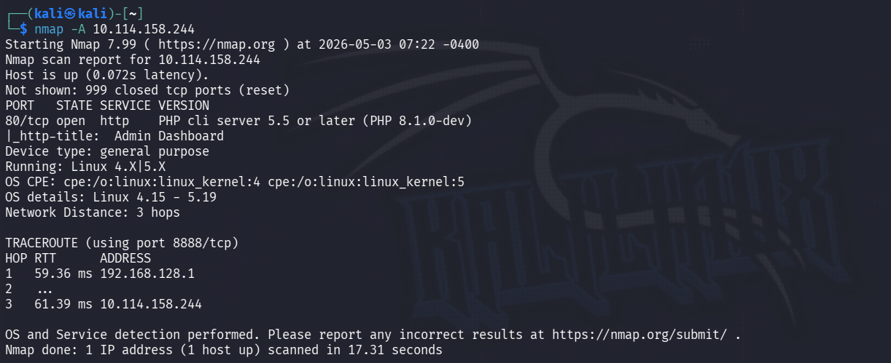
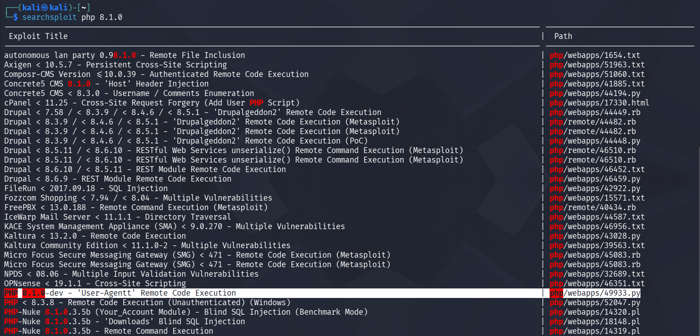
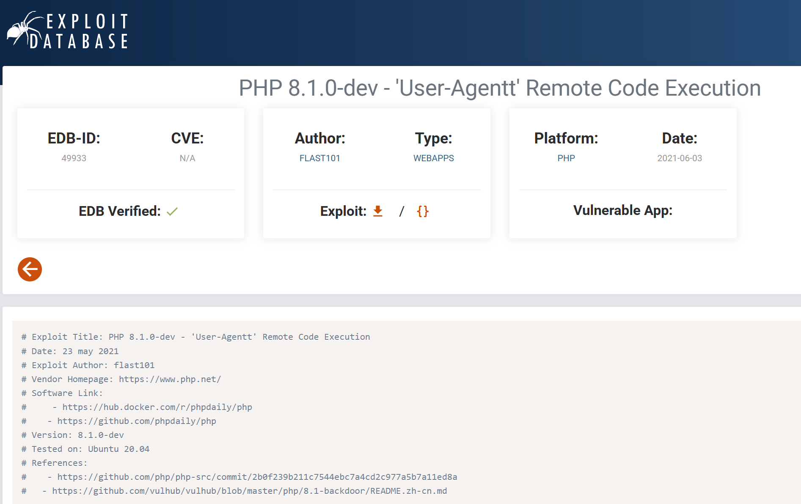
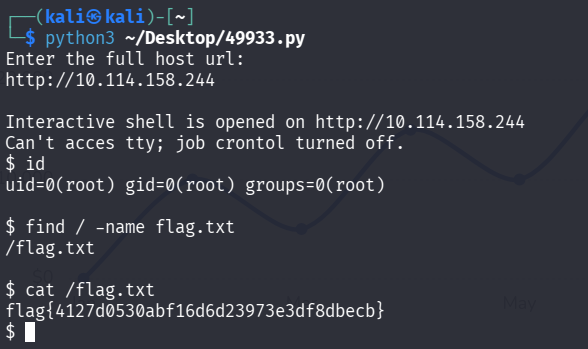

# Agent T

> Полное прохождение лаборатории. Материал содержит спойлеры и предназначен только для легальной учебной практики.

**Лаборатория:** [открыть комнату на TryHackMe](https://tryhackme.com/room/agentt)

## Ход работы

Привет! Начнем!

Как всегда, начинаем со сканирования nmap:

```bash
nmap -A 10.114.158.244
```



Видим, что открыт 80 порт http, так же определилась версия клиента PHP 8.1.0-dev, эксплойт на которую мы попробуем найти:

```bash
searchsploit php 8.1.0
```



Также, можем найти его на сайте exploit-db:



Запустим эксплойт:



Flag - flag{4127d0530abf16d6d23973e3df8dbecb}
