# ColddBox: Easy

> Полное прохождение лаборатории. Материал содержит спойлеры и предназначен только для легальной учебной практики.

**Лаборатория:** [открыть комнату на TryHackMe](https://tryhackme.com/room/colddboxeasy)

## Ход работы

Привет! Начнем!

Как всегда начинаем со сканирования nmap:

```bash
nmap -sV -p- 10.114.168.236
```

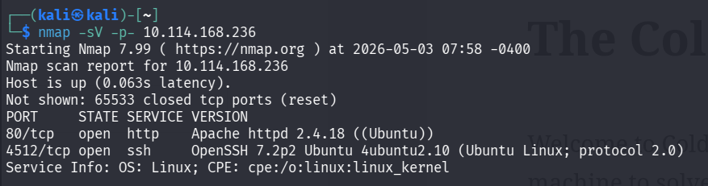

Видим, открыты 2 порта: 80 http и 4512 ssh. Переходим на веб-сайт и видим, что он написан на CMS WordPress:

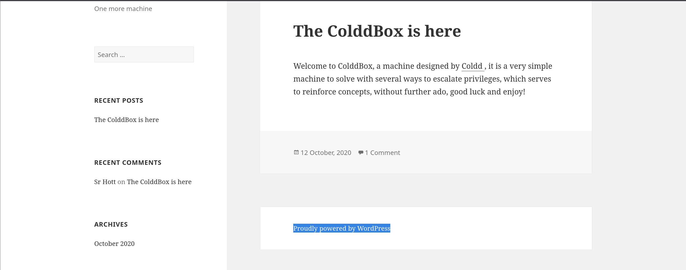

Для работы с CMS WordPress мне сразу же пришла в голову утилита WPScan. Она обладает большим функционалом и для наших целей я решил использовать следующие ключи:

```bash
wpscan --url http://10.114.168.236 -e vt,vp,u
```

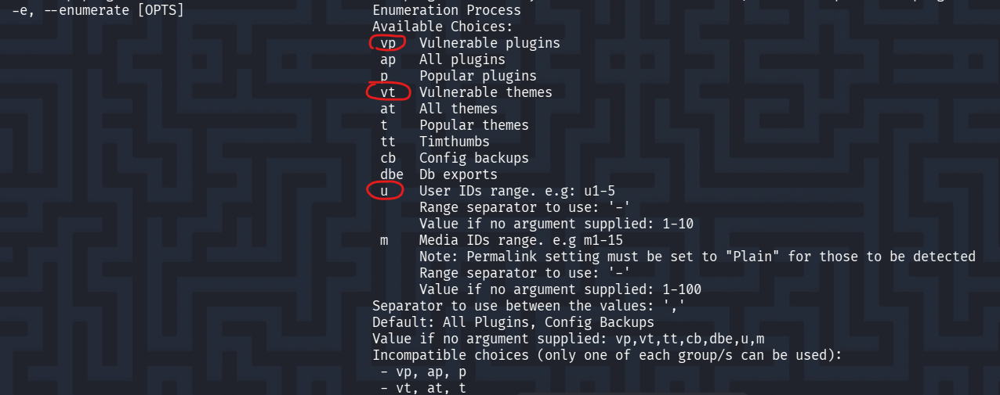

Ключом u мы обнаружили несколько пользователей:

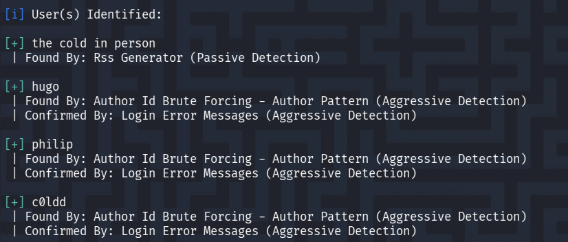

Так как мы обнаружили активных пользователей, мы можем попытаться подобрать к ним пароли. Используем также WPScan и список паролей Rockyou.txt. Мы можем не указывать явно список найденных пользователей, т.к. утилита снова их обнаружит и будет перебирать пароли из словаря по кругу:

```bash
wpscan --url http://10.114.168.236 --passwords ~/Downloads/rockyou.txt
```

Спустя некоторое время был подобран пароль к учетной записи c0ldd:

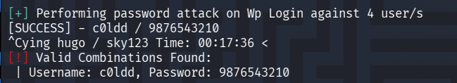

c0ldd:9876543210

Войдем с найденными учетными данными в личный кабинет веб-приложения:

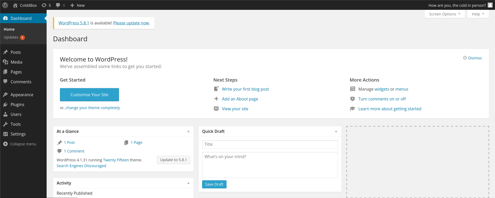

Дальше я задумался, как мне получить обратную оболочку. Погуляв по кабинету я обнаружил, что можно редактировать файлы с расширением .php. На скрине ниже видно, шаблон 404.php можно отредактировать, добавив код обратной оболочки PentestMonkey:

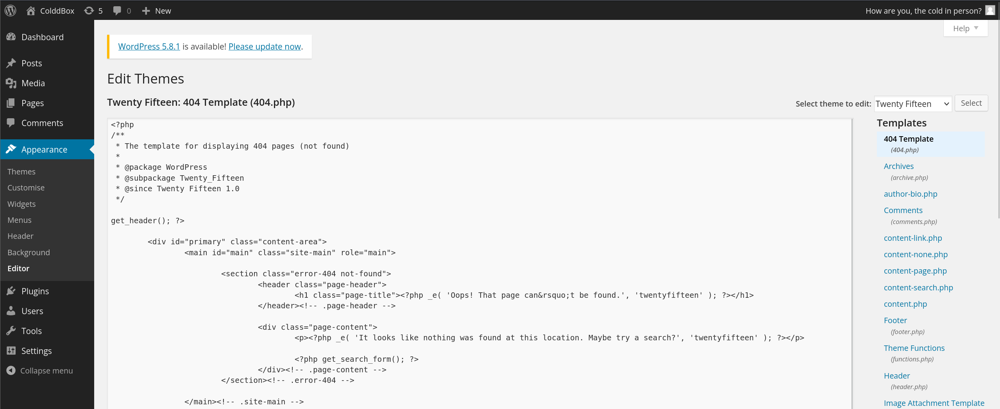

Сам код взят с GitHub:

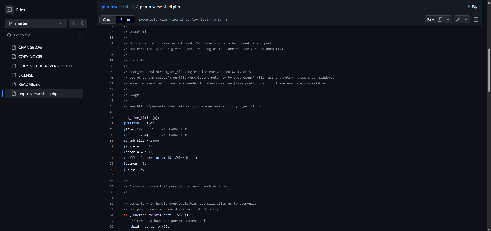

Не забываем изменить в коде ip-адрес нашей машины или VPN-туннеля:

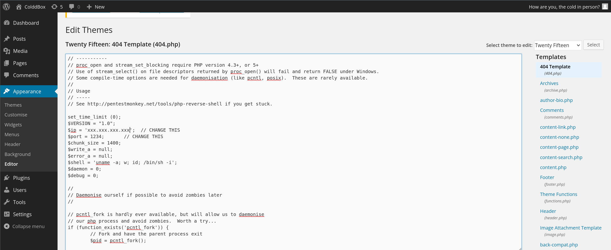

Сохраним код и запустим слушатель nc на нашей машине:

```bash
nc -nlvp 1234
```

Теперь перейдем по пути /wp-content/themes/twentyfifteen/404.php или допишем после ip-адреса [/?p=10](http://10.113.133.150/?p=10) (10 может быть любым числом).

Мы получили reverse shell! Видим оболочку sh, сделаем из нее оболочку bash с tty для удобства:

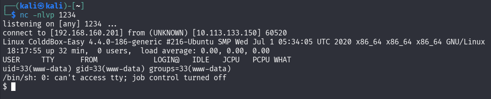

```bash
python3 -c 'import pty; pty.spawn("/bin/bash")'
```

```bash
export TERM=xterm
```

- свернем на задний план нашу оболочку командой ctrl+z

- уже на локальной машине введем stty raw -echo; и нажмем Enter

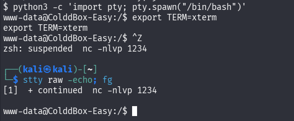

Получив новую оболочку, займемся поиском нашего флага user.txt:

```bash
find / -name user.txt
```

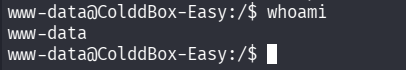

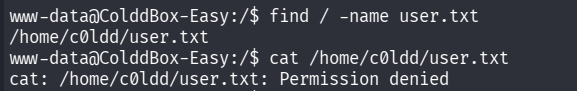

У пользователя www-data не оказалось прав на просмотр этого файла:

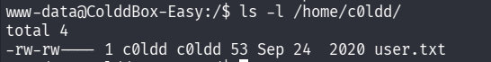

Тут я принялся за поиски способов повышения привилегий. sudo -l не работает:

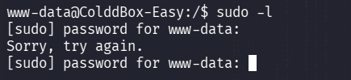

Пробуем найти файлы с suid-битами:

```bash
find / -type f -perm -04000 -ls 2>/dev/null
```

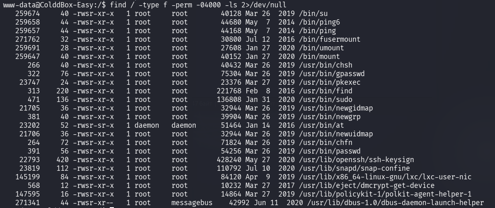

Проанализировав этот список и обратив внимание на find, перейдем на GTFOBins:

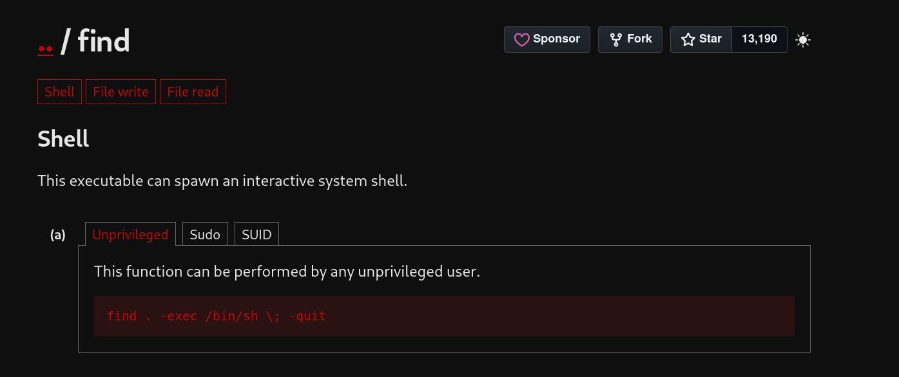

Я пытался повысить привилегии с помощью вышеуказанной команды, но ничего не вышло. Опытным путем я выяснил, что дело было в нашей оболочке bash, которую мы устанавливали для удобства. Повторно подключившись к целевой машине и оставив оболочку sh по умолчанию, привилегии были успешно повышены:

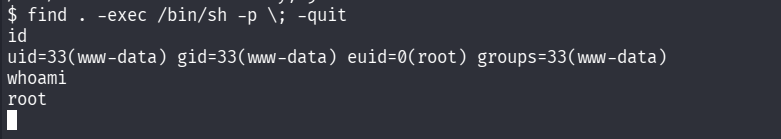

Осталось прочитать наши флаги:

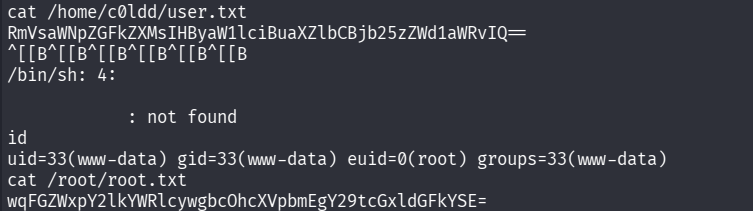

user.txt - RmVsaWNpZGFkZXMsIHByaW1lciBuaXZlbCBjb25zZWd1aWRvIQ==

root.txt - wqFGZWxpY2lkYWRlcywgbcOhcXVpbmEgY29tcGxldGFkYSE=
