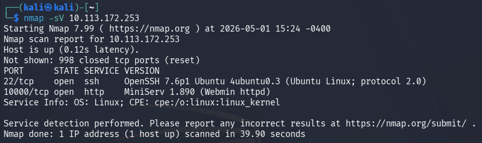
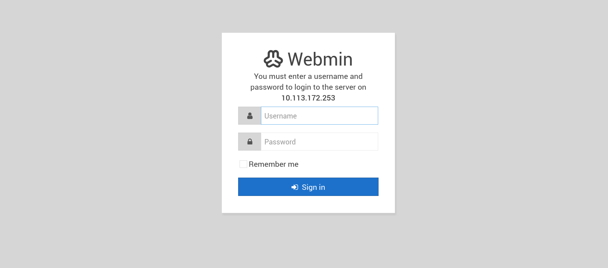
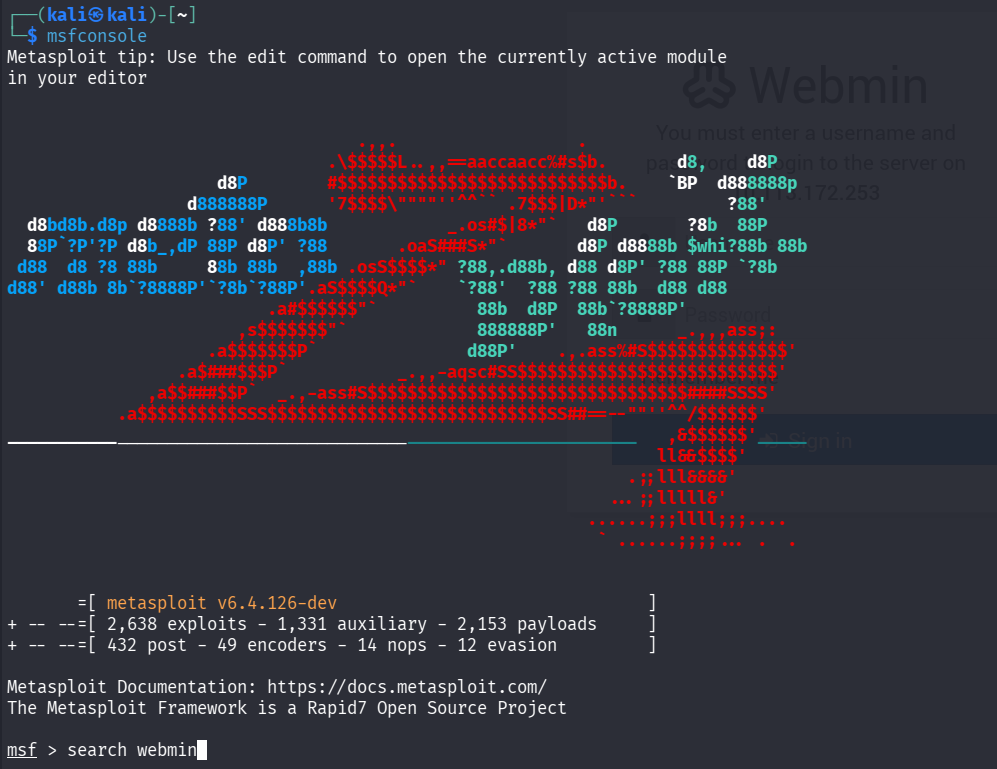
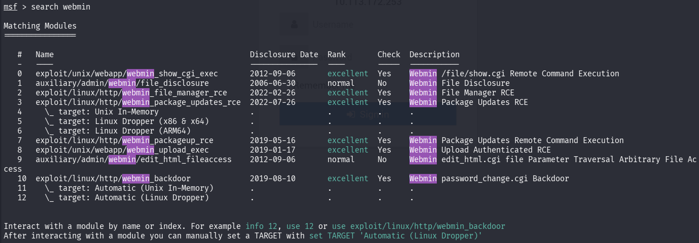
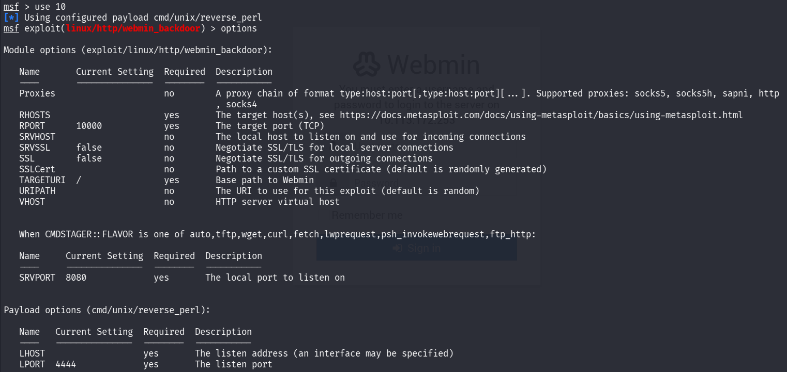
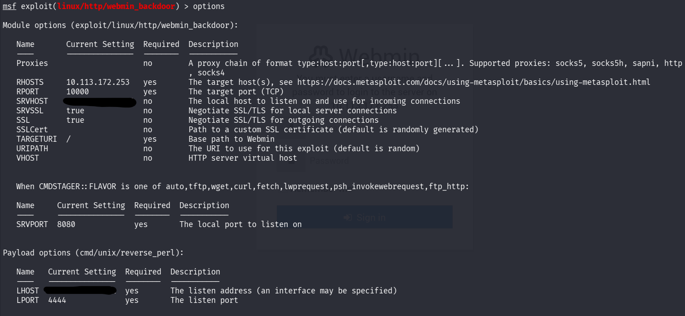
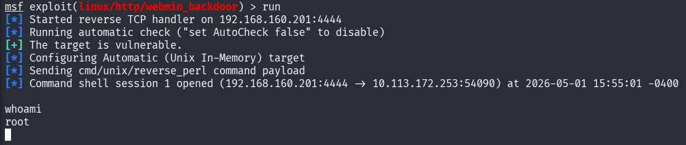
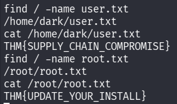

# Source

> Полное прохождение лаборатории. Материал содержит спойлеры и предназначен только для легальной учебной практики.

**Лаборатория:** [открыть комнату на TryHackMe](https://tryhackme.com/room/source)

## Ход работы

Привет! Начнем!

Первым делом запустим сканирование nmap:

```bash
nmap -sV 10.113.172.253
```



Видим 2 открытых порта – 22 и 10000. Перейдем в браузере на порт 10000:



Видим, что на этом порту сервис Webmin (nmap тоже его определил), форму для входа, сразу попробовал стандартные admin:admin, admin:password и тд, но ничего не сработало.  Попробуем найти уязвимости сервиса Webmin в Metasploit. Запускаем:



Командой search Webmin ищем эксплойты:



Выберем exploit/linux/http/webmin_backdoor командой use 10 и откроем его опции для настройки:



Нам нужно правильно настроить эксплойт для того, чтобы он отработал. Устанавливаем такие параметры, как RHOSTS (атакуемый ip-адрес), SRVHOST (адрес нашей машины), SSL (нужно поставить значение True, т.к. у веб-приложения нет сертификата, о чем нас предупредил браузер), а также LHOST (адрес нашей машины):



Запускам командой run:



Мы правильно настроили эксплойт, он отработал и дал нам пользователя root. Ищем флаги командой find –name user.txt/root.txt:



user.txt – THM{SUPPLY_CHAIN_COMPROMISE}

root.txt - THM{UPDATE_YOUR_INSTALL}
